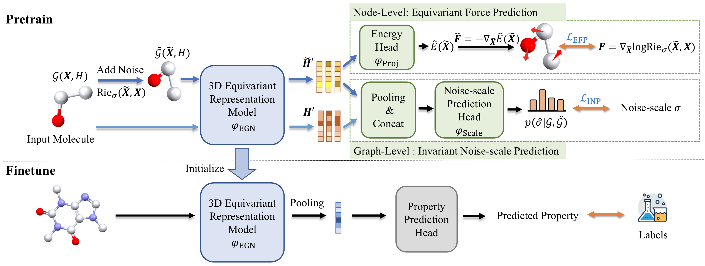

# Q_Model: Energy-Motivated Equivariant Pretraining for 3D Molecular Graphs (AAAI 2023)

The model for the prediction of Q values is based on the 3D-EMGP model.

[](https://github.com/jiaor17/3D-EMGP/blob/main/LICENSE)   [**[Paper]**](https://arxiv.org/pdf/2207.08824.pdf)



## Environment

### create a new conda environment

``` shell
conda create -n 3DGNN python=3.8
conda activate 3DGNN
```
### Requirements
```
ase==3.22.1
easydict==1.9
matplotlib==3.6.2
networkx==2.8.6
numpy==1.22.4
pandas==1.5.0
PyYAML==6.0.2
rdkit_pypi==2022.9.5
scikit_learn==1.1.1
scipy==1.7.1
torch_cluster==1.6.0
torch_geometric==2.0.4
torch_scatter==2.0.9
torch_sparse==0.6.14
tqdm==4.64.1
```

You could simply run

```
pip install -r requirements.txt
```

to install other packages.

## Datasets

Our 778 energetic molecules with their Q values and detailed train, valid, test data are provided in the folder ``` Q_model/data/778Q```.

## Finetuning on QM9 and Prediction

Finetuning on QM9 :

```
python -u script/finetune_mdn.py --config_path config/finetune_qm9.yml --restore_path <pretrained_checkpoint> --property <property>
```

The property should be chosen from

```
alpha, gap, homo, lumo, mu, Cv, G, H, r2, U, U0, zpve
```
Note that the finetuning datasets will be automatically downloaded and preprocessed on the first run.

If you want to fine-tune the pre-trained 3D-GNN model with other property, the ```Q_model/script/trans.py``` can be used to generate molecular file with its label which as the input.


## Citation

```
@misc{jiao2022energy,
  url={https://arxiv.org/abs/2207.08824},
  author={Jiao, Rui and Han, Jiaqi and Huang, Wenbing and Rong, Yu and Liu, Yang},
  title={Energy-Motivated Equivariant Pretraining for 3D Molecular Graphs},
  publisher={arXiv},
  year={2022}
}
```